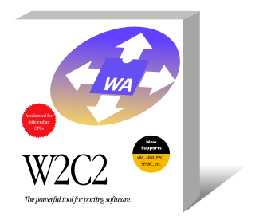

<p align="center">
  
</p>

# w2c2

Translates WebAssembly modules to portable C.
Inspired by [wabt's wasm2c](https://github.com/WebAssembly/wabt/tree/main/wasm2c).

Working towards [WebAssembly as the Elusive Universal Binary](https://kripken.github.io/talks/2020/universal.html#/):

```
                                          ↗ different
  source code     →  WebAssembly  →  C89  → OSes,
(C++, Rust, ...)                          ↘ CPUs
```


## Features

- Implements the [WebAssembly Core Specification 1.0](https://www.w3.org/TR/wasm-core-1/)
- Implements several extensions:
  - [Threads and atomics](https://github.com/WebAssembly/threads/blob/master/proposals/threads/Overview.md)
  - [Bulk memory operations](https://github.com/WebAssembly/bulk-memory-operations/blob/master/proposals/bulk-memory-operations/Overview.md)
  - [Conditional data segment initialization](https://github.com/WebAssembly/bulk-memory-operations/blob/master/proposals/bulk-memory-operations/Overview.md)
  - [Sign-extension operators](https://github.com/WebAssembly/sign-extension-ops/blob/master/proposals/sign-extension-ops/Overview.md)
  - [Non-trapping float-to-int conversions](https://github.com/WebAssembly/nontrapping-float-to-int-conversions/blob/main/proposals/nontrapping-float-to-int-conversion/Overview.md)
- Passes 99.9% of the WebAssembly core semantics test suite
- Written in C89 and generates C89
- Support for many operating systems (e.g. Mac OS X, Mac OS 9, Haiku, Rhapsody, OPENSTEP, NeXTSTEP, DOS, Windows XP, etc.)
- Support for many architectures (e.g. x86, ARM, PowerPC, SPARC, PA-RISC, etc.)
- Support for big-endian systems (e.g. PowerPC, SPARC, PA-RISC, etc.)
- Streaming/single-pass compilation, low memory usage
- Separate compilation into multiple files
- Parallel compilation
- Assist with incremental compilation: Separate static and dynamic functions by comparing with another module
- Support for multiple modules and instances
- Support for generating debug information:
  - Function names, if function names are provided in the [`names` custom section](https://webassembly.github.io/spec/core/appendix/custom.html#function-names)
  - Source line mapping, if DWARF line information is provided in the [`.debug_line` custom section](https://yurydelendik.github.io/webassembly-dwarf/).
    Requires [libdwarf](https://github.com/davea42/libdwarf-code) to be installed. See instructions below.
- WASI implementation
  - Able to run clang and Python
  - Support for many operating systems and architectures, support for big-endian systems
  - Implements the [threads proposal](https://github.com/webAssembly/wasi-threads)

## Performance

- Coremark 1.0: ~7% slower than native

## Compilation

If your system is supported by at least CMake 2.8.12, prefer using CMake to detect features.
On systems without CMake you can also use Make.

### w2c2

```sh
cd w2c2
cmake -B build
cmake --build build
```

### wasi

```sh
cd wasi
cmake -B build
cmake --build build
```

## Usage

For example, to compile `module.wasm` to `module.c` (and `module.h`):

```sh
./w2c2 module.wasm module.c
```

### Separate Compilation

w2c2 is able to compile a module into separate C files.
This is recommended when compiling large modules and on hosts with limited resources.

For example, to compile `module.wasm` (and `module.h`), into multiple files with 100 functions each:

```sh
./w2c2 -f 100 module.wasm module.c
```

### Parallel Compilation

When w2c2 was built with threading support, it is able to compile a module in parallel.
By default, w2c2 spawns as many worker threads as CPU cores are available.

To manually specify the number of worker threads, pass the number using the `-t` flag.

For example, to compile using 2 threads:

```sh
./w2c2 -t 2 module.wasm module.c
```

## Examples

Coremark:

```sh
cd examples/coremark
make
./coremark
```

## Testing

Requires Python 3 and [wabt](https://github.com/WebAssembly/wabt) (for `wast2json`).

```sh
cd tests
make gen
make run-tests
```

## WASI Status

- [x] `args_get`
- [x] `args_sizes_get`
- [x] `clock_res_get`
- [x] `clock_time_get`
- [x] `environ_get`
- [x] `environ_sizes_get`
- [ ] `fd_advise`
- [ ] `fd_allocate`
- [x] `fd_close`
- [x] `fd_datasync`
- [x] `fd_fdstat_get`
- [ ] `fd_fdstat_set_flags`
- [ ] `fd_fdstat_set_rights`
- [x] `fd_filestat_get`
- [ ] `fd_filestat_set_size`
- [ ] `fd_filestat_set_times`
- [x] `fd_pread`
- [x] `fd_prestat_get`
- [x] `fd_prestat_dir_name`
- [x] `fd_pwrite`
- [x] `fd_read`
- [x] `fd_readdir`
- [ ] `fd_renumber`
- [x] `fd_seek`
- [x] `fd_sync`
- [x] `fd_tell`
- [x] `fd_write`
- [x] `path_create_directory`
- [x] `path_filestat_get`
- [ ] `path_filestat_set_times`
- [ ] `path_link`
- [x] `path_open`
- [x] `path_readlink`
- [x] `path_remove_directory`
- [x] `path_rename`
- [x] `path_symlink`
- [x] `path_unlink_file`
- [ ] `poll_oneoff`
- [x] `proc_exit`
- [x] `random_get`
- [ ] `sched_yield`
- [ ] `sock_recv`
- [ ] `sock_send`
- [ ] `sock_shutdown`
- [x] `thread-spawn` (from the [threads proposal](https://github.com/webAssembly/wasi-threads))

## Development

To build a debug release, pass `BUILD=debug` to `make`.

To enable sanitizers, list them in the `SANITIZERS` variable passed to `make`, e.g. `make BUILD=debug SANITIZERS="base clang address thread"`.
- `base` enables the [Undefined Behavior Sanitizer](https://clang.llvm.org/docs/UndefinedBehaviorSanitizer.html)
- `clang` enables Clang-specific sanitizers
- `thread` enables the [Thread Sanitizer](https://clang.llvm.org/docs/ThreadSanitizer.html)
- `address` enables the [Address Sanitizer](https://clang.llvm.org/docs/AddressSanitizer.html)

## Installing libdwarf (required for source line mapping)

- On Linux, try installing a package named like `libdwarf-dev`
- On macOS, you can use [Homebrew](https://brew.sh/) and install `libdwarf` (not `dwarf`!)
- w2c2 currently defaults to using the libdwarf API of >=v0.4.2. v0.6.0 has been tested to work successfully too.
- If using a version <0.4.2, try passing `-DDWARF_OLD=1` to CMake. Version 20200114 is known to work.
- Since version 0.1.1, libdwarf ships with a pkg-config file, which CMake should be able to detect automatically.

  If libdwarf cannot be automatically found by CMake, you get the following message:

  ```
  -- Checking for module 'libdwarf'
  --   No package 'libdwarf' found
  ```

  In that case you can still provide the necessary information manually by passing a variation of the following options:

  ```
  -DDWARF_FOUND=1 -DDWARF_LIBRARIES=-ldwarf -DDWARF_LIBRARY_DIRS=/usr/lib -DDWARF_INCLUDE_DIRS=/usr/include/libdwarf
  ```

